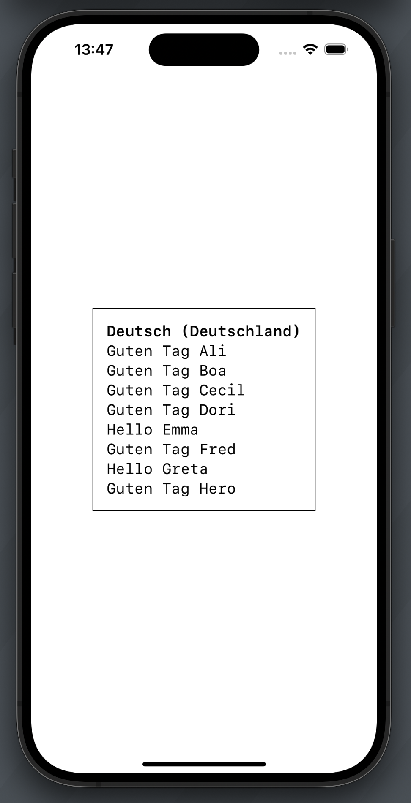
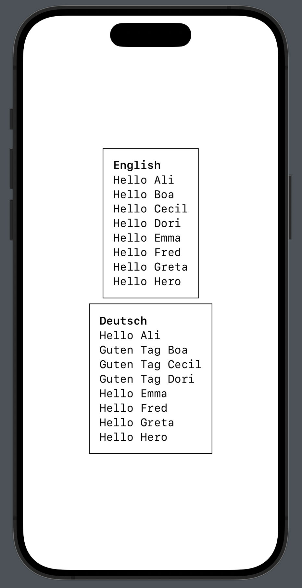

#  Localization with String Catalogs

## Resources

- [Localizing and varying text with a string catalog](https://developer.apple.com/documentation/xcode/localizing-and-varying-text-with-a-string-catalog)
- [Discover String Catalogs](https://developer.apple.com/videos/play/wwdc2023/10155)
- [Editing XLIFF and string catalog files](https://developer.apple.com/documentation/xcode/editing-xliff-and-string-catalog-files)

## Traits

|ID|Type|SC compatible|SwiftUI|SwiftUI previews|UIKit|Key Access|Parameters|
|:-:|---|:-:|:-:|:-:|:-:|:-:|:-:|
|a|`Swift.String.LocalizationValue`    |✅|✅⚠️|❌|✅⚠️|❌|❌|
|b|`SwiftUI.LocalizedStringKey`        |✅|✅  |✅|❌  |❌|❌|
|c|`Foundation.LocalizedStringResource`|✅|✅  |✅|✅⚠️|✅|✅|
|d|`SwiftUI.Text`                      |✅|✅  |✅|❌  |❌|✅|
|f|`Foundation.NSLocalizedString`      |✅|✅  |❌|✅  |❌|✅|
|g|`Swift.String` extension            |❌|✅  |❌|✅  |❌|❌|
|h|`Swift.String(localized:)`          |✅|✅  |❌|✅  |❌|✅|


### Legend
|Key|Description|
|---|---|
|ID|The variable name in the `Examples`|
|Type|The type to store a localizable key|
|SC compatible|Does the string catalog automatically find the specified keys in the project?|
|SwiftUI|Do SwiftUI symbols come with an interface?|
|SwiftUI previews|Do SwiftUI previews automatically reflect the current locale from environment?|
|UIKit|Do UIKit symbols come with an interface?|
|Key Access|Can the raw key be accessed, e.g. in tests?|
|Parameters|Are parameters for choosing `comment`, `table`, `bundle` for the key available?|

- ⚠️ Some types can and need to be converted into `String` before using them in `UIKit`, or `SwiftUI`
    - `String(localized resource: LocalizedStringValue)`
    - `String(localized resource: LocalizedStringResource)`

## String Interpolation

All "SC compatible" types also support String interpolation to insert dynamic values into the localizable key.

For simplification these examples are not added to the project. The following code would result in a string catalog entry: `Hello %@`

```swift
func greeting(with name: String) -> LocalizedStringResource {
    LocalizedStringResource(
        "Hello \(name)",
        comment: "A short greeting with a name parameter"
    )
}
```

## App vs. Preview

|App|SwiftUI preview|
|:-:|:-:|
|||
